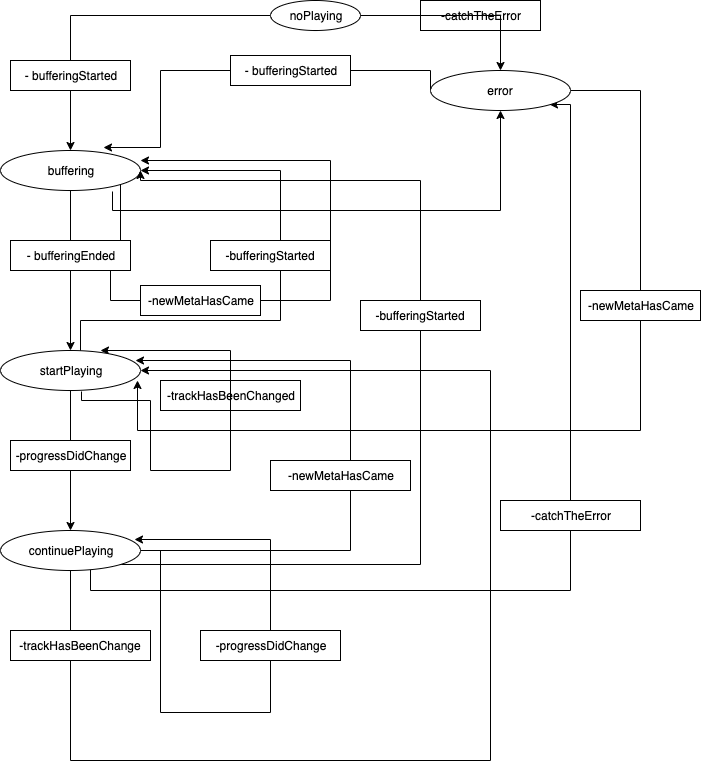

# ios-marconi-poc
iOS mobile testing tool for Marconi streams

### Structure of project

The project contains 2 separated modules/frameworks and target app (descriptions of each of them are listed below):

- [x] **FutureKit** - framework which provides an API for performing nonblocking asynchronous requests and combinator interfaces for serializing the processing of requests, error recovery and filtering. In most iOS libraries asynchronous interfaces are supported through the delegate-protocol pattern or with a callback. Even simple implementations of these interfaces can lead to business logic distributed over many files or deeply nested callbacks that can be hard to follow. **FutureKit** provides a very simple API to get rid of callback hell (inspired by [www.swiftbysundell.com](https://www.swiftbysundell.com/articles/under-the-hood-of-futures-and-promises-in-swift/)).

- [x] **ios-marconi-framework** - framework which encapsulate all logic related to processing metadata depends on station type (currently support digital/live station).
**ios-marconi-framework** has been implemented upon **State Machine** pattern, supporting following states:

- case **noPlaying** - idle state;

- case **buffering(AVPlayerItem)** -  current AVPlayerItem has been initialized, and added to Player, but it's not ready to play;

- case **startPlaying(MetaData)** -  current AVPlayerItem is ready to play, with metadata (triggered either for live or digital station);

- case **continuePlaying(MetaData, TimeInterval)** - state is triggered when progress for current item should be updated (triggered either for digital station ONLY);

- case **error(MError)** - state is triggered when caught any error;

Graph given below, describes the transitions between states:



or the same in code:

```swift
func transition(with event: Event) {
    switch (state, event) {
        case (.buffering, .bufferingStarted(_)): break
        case (_, .bufferingStarted(let playerItem)):
            state = .buffering(playerItem)
        case (.buffering, .bufferingEnded(let playingItem)):
            state = .startPlaying(playingItem, false)
        case (.buffering, .newMetaHasCame(_)):
             // fetched meta data but buffering still in progress
             break
        case (.startPlaying(let old, _), .newMetaHasCame(let new)):
            if old != new {
                state = .startPlaying(new, false)
             }
        case (_, .bufferingEnded(let new)):
            state = .startPlaying(new, false)
        case (.noPlaying, .newMetaHasCame(_)): break
        case (_, .startPlaying): break
        case (.error, .catchTheError(_)): break
        case (_, .catchTheError(let error)):
            state = .error(.playerError(description: error?.localizedDescription))
        case (.error(_), .newMetaHasCame(let new)):
            state = .startPlaying(new, false)
        case (.startPlaying(let playingItem, _), .progressDidChanged(let progress)):
            state = .continuePlaying(playingItem, progress)
        case (.continuePlaying(_, _), .newMetaHasCame(let new)):
            state = .startPlaying(new, false)
        case (.continuePlaying(let meta, _), .progressDidChanged(let progress)):
            state = .continuePlaying(meta, progress)
        case (_, .progressDidChanged(_)):
            // if not playing there is no sense to update progress (state)
            break
        case (.continuePlaying(_, _), .trackHasBeenChanged(let new)):
            state = .startPlaying(new, true)
        case (.startPlaying(_, _), .trackHasBeenChanged(let new)):
            state = .startPlaying(new, true)
        case (_, .trackHasBeenChanged(_)): break
        }
    }
```

[Marconi.Player](https://github.com/Entercom/ios-marconi-poc/tree/master/ios-marconi-framework/ios-marconi-framework/MarconiPlayer) inherited from AVFoundation [AVPlayer](https://developer.apple.com/documentation/avfoundation/avplayer).

Usage:
Client code should use Marconi.Player instance, instead of AVPlayer, subscribing under states listed above, changing UI accordingly. 
*Please note, if client is not subscribed, Marconi.Player will behave itself as regular AVPlayer*.


- [x] **ios-marconi-app** - iOS target which aggregates all frameworks listed above.

### How run the project

- Since app uses 3rd part framework, distributed via cocoapods. Install cocoapods in regular way:
	- Change the working directory (currently **ios-marconi-poc**);
	- Then, run the following command:
		```
		$ pod install
		``` 
- Open ios-marconi-poc.xcworkspace;
- Build and run the ios-marconi-app target;


